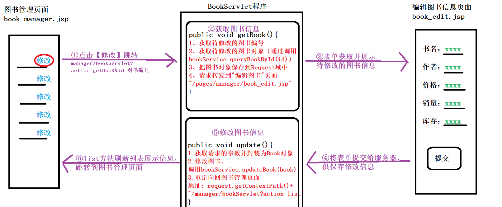
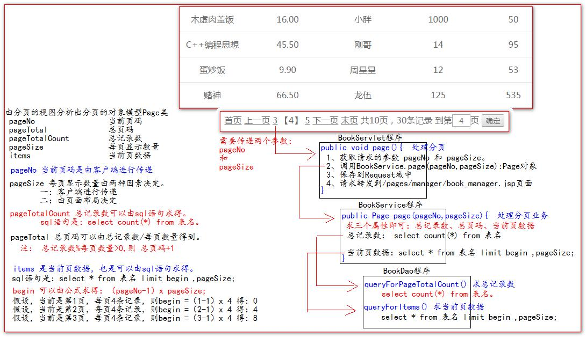
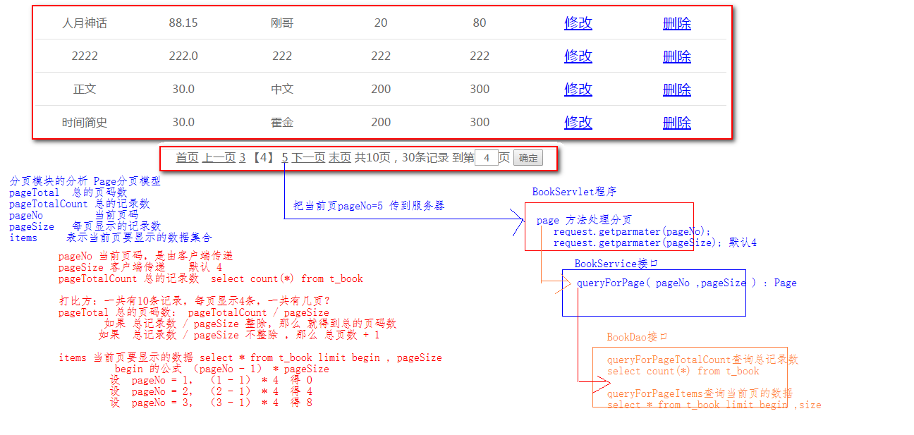
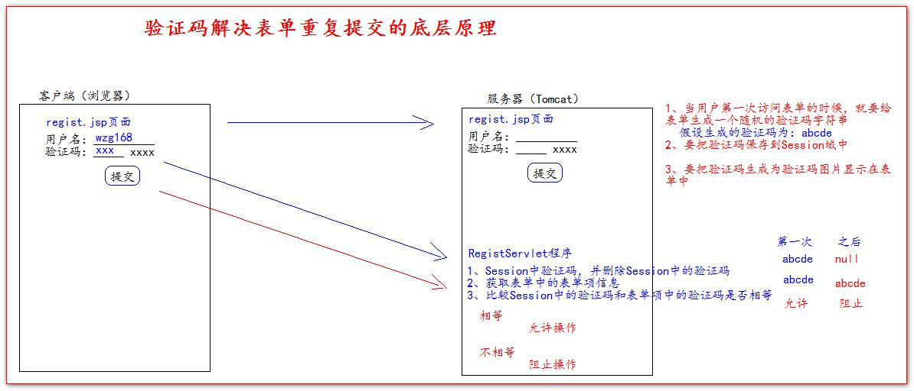
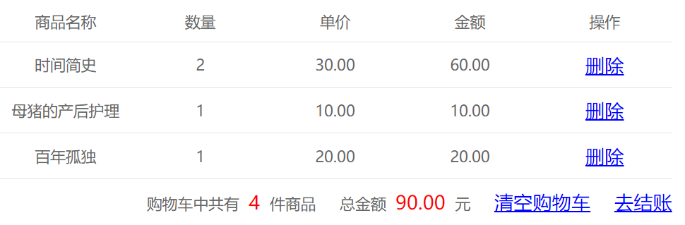
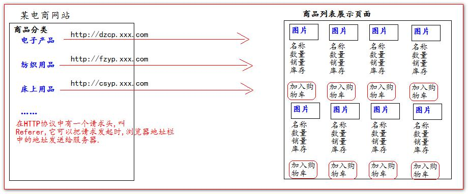
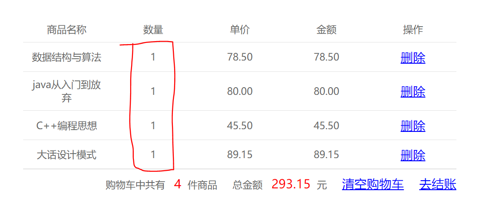
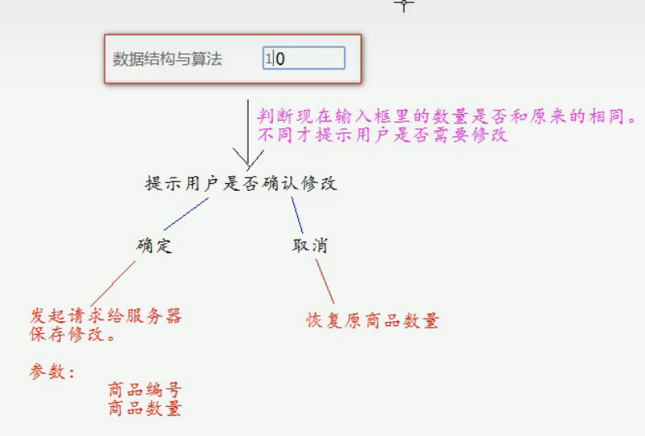
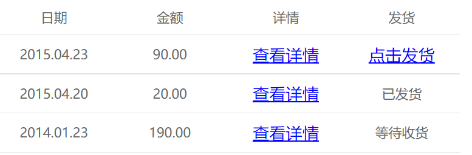
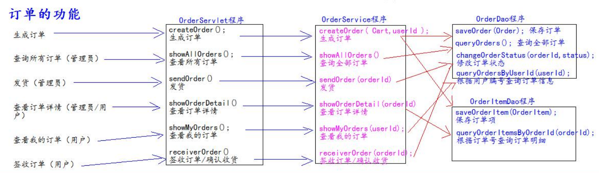

# BookShop

尚硅谷_书城项目

[GitHub - LoongKK/BookShop](https://github.com/LoongKK/BookShop)

## 第一次提交

空项目 静态资源  
(熟悉git使用)

# 第一阶段 表单验证的实现

## 需求

验证用户名：必须由字母，数字下划线组成，并且长度为 5 到 12 位  
验证密码：必须由字母，数字下划线组成，并且长度为 5 到 12 位  
验证确认密码：和密码相同  
邮箱验证：xxxxx@xxx.com  
验证码：现在只需要验证用户已输入。因为还没讲到服务器 验证码生成。

## 操作：

①首先引入jQuery
文件放置在static/script/jquery-1.7.2.js  
在regist.html中引入jQuery。见pages/user/regist.html

②在regist中实现需求. 见pages/user/regist.html

# 第二阶段 用户登录和注册

## 一、需求

项目阶段二：用户注册和登陆的实现。
### 需求 1：用户注册

1）访问注册页面  
2）填写注册信息，提交给服务器  
3）服务器应该保存用户  
4）当用户已经存在----提示用户注册 失败，用户名已存在  
5）当用户不存在-----注册成功  
### 需求二：用户登陆

1）访问登陆页面  
2）填写用户名密码后提交  
3）服务器判断用户是否存在  
4）如果登陆失败 --->>>> 返回用户名或者密码错误信息  
5）如果登录成功 --->>>> 返回登陆成功 信息  
## 二、搭建书城项目开发环境(准备工作)：

①首先新建java模块BookShop，添加web支持，将第一阶段的静态资源复制到web目录下，可删掉默认的index.jsp。  
②配置"运行/调试配置”，本地Tomcat服务器 "BookShop_Tomcat 8.0.53"并添加工件（注意修改应用上下文为“/BookShop”）  
③创建包

```
└── com
    └── loong
        ├── dao Dao接口包
        │   └── impl  Dao接口实现类包
        ├── pojo  javabean类
        ├── service Service接口包
        │   └── impl Service接口实现类包
        ├── test 存放测试类
        ├── utils 存放工具类
        └── web web层
```

## 三、创建数据库和表

```mysql
drop database if exists book;
create database book;
use book;
create table t_user(
`id` int primary key auto_increment,
`username` varchar(20) not null unique,
`password` varchar(32) not null,
`email` varchar(200)
);
insert into t_user(`username`,`password`,`email`) values('admin','admin','admin@loong.com');
select * from t_user;
```

## 四、编写数据库对应的javaBean对象

com.loong.pojo 下 User.java 对应t_user表

## 五、编写工具类 JDBCUtils

（1）web/WEB-INF/lib文件夹导入jar包：  
  mysql-connector-java-8.0.26.jar、  
  druid-1.2.11.jar、  
  commons-dbutils-1.7.jar。    
（2）“库”将jar包添加为库BookShop_lib,“模块”给模块BookShop使用(添加依赖)，再在”工件“处修复（将模块需要的该库加入到工件）。  
（3）编写jdbc.properties  I（src下）  
（4）编写工具类JDBCUtils.java 包com.loong.utils  
（5）*测试工具类Utilstest.java 包com.loong.test  
## 六、Dao持久层

（1）BaseDao.java 基本Dao （com.loong.dao.impl下）  
（2）UserDao.java 接口 （com.loong.dao下）  
（3）UserDaoImpl.java 实现类 （com.loong.dao.impl下）  
(4)* UserDaoTest.java 测试类 （com.loong.test下）    
   在接口UserDao中右击 生成 测试... 全选方法
## 七、Service业务层

（1）UserService.java 接口  com.loong.service包  
（2）UserServiceImpl.java 实现类 com.loong.service.impl包下  
（3）UserServiceTest.java 测试类 com.loong.test包下  
## 八、Web层（视图展现层）

（先将servlet-api.jar加入到库BookShop_lib中）  
（servlet不管多复杂 永远都是那四步1.获取参数 2.调用Service 3.将数据共享到域 4.路径跳转）
### 实现用户注册功能

当在注册页面用户输入完成并点击提交，将参数发送给服务器来注册保存。  
1.RegistServlet程序：
RegistServlet.java（com.loong.web 包下）  
逻辑：
```
获取请求参数;
if(验证码正确){
    if(用户名可用){
        调用Service保存到数据库;
        跳转到注册成功页面regist_success.html;
    }else{
        跳回注册页面regist.html;
        }
}else{
    跳回注册页面regist.html;
}
```
并配置web.xml。  
2.修改页面regist.html和regist_success.html  
[regist.html](web/pages/user/regist.jsp)  
[regist_success.html](web/pages/user/regist_success.jsp)  
主要改动：  
（1）两个html中都增加`<base>` 标签（永远固定相对路径跳转的结果），并修改受其影响的相对路径。  
实际项目中，base的harf属性值一般写到工程路径。  
`<base href="http://localhost:8080/BookShop/">`  
然后修改受其影响的相对路径（技巧：浏览器预览页面，F12看控制台报红的找不到的js、css、图片等资源）  
“base写到工程路径”相当于到了web目录下，再相对web目录来写相对路径，如  
`<link type="text/css" rel="stylesheet" href="static/css/style.css" >`  
（实际文件路径BookShop项目/web/static/css/style.css）  
（2）修改regist.html中表单提交的地址为Servlet程序,请求方式为post。  
`<form action="registServlet" method="post">`
### 实现用户登录功能

当用户输入完毕，点击”登录“（提交）后，将参数发送给服务器。  
1.LoginServlet程序  
LoginServlet.java（com.loong.web 包下）  
逻辑:
```
获取请求的参数；
调用XxxService.xxx()处理业务。如userService。login()登录;
if(根据Login（）方法返回结果判断,登录成功?){
    跳转到成功页面login_success.html;
 }else{
    跳回登录页面；
 }
```

并配置web.xml。
2.修改login.html页面和login_success.html页面(参考前面的，不多说)  
（1）添加 base 标签，并修改相对路径  
（2）修改login.html中表单提交的地址为Servlet程序,请求方式为post  

# 第三阶段：使用jsp动态化页面

## 页面jsp动态化  
1、在 html 页面顶行添加 page 指令。  
 即`<%@ page contentType="text/html;charset=UTF-8" language="java" %>`  
```shell
#我用的linux子系统（ubuntu） 在pages文件夹下
$ sed -i '1i <%@ page contentType="text/html;charset=UTF-8" language="java" %>' */*.html
```
2、修改文件后缀名为：.jsp(重命名快捷键shift+F6)  
```shell
#我用的linux子系统（ubuntu） 在pages文件夹下
$ rename 's/\.html/\.jsp/' */*.html
```
3、使用 IDEA 搜索替换.html 为.jsp(快捷键：Ctrl+Shift+R)
```shell
#我用的linux子系统（ubuntu） 在pages文件夹下
$ sed -n 's/\.html/\.jsp/p' */*.jsp #预览
$ sed -i 's/\.html/\.jsp/g' */*.jsp #直接对文件操作
```
(除了pages下的页面，别忘了还有index.html需要做这些修改。)
(Servlet程序里的请求转发也要改成".jsp"。)
## 抽取页面中相同的内容  
将不同页面的相同内容抽取为一个公共页面，通过包含或页面转发使用。  
web/pages下新建目录common存放公共页面

（1）head 中 css、jquery、base 标签  
head.jsp

```html
<body>
<%
//    "http://localhost:8080/BookShop/"
    String basePath = request.getScheme()
            + "://"
            + request.getServerName()
            + ":"
            + request.getServerPort()
            + request.getContextPath()
            + "/";
%>

<%--动态的获取base的href属性值<%=basePath%>--%>
<base href="<%=basePath%>">
<link type="text/css" rel="stylesheet" href="static/css/style.css" >
<script type="text/javascript" src="static/script/jquery-1.7.2.js"></script>
</body>
```

静态包含:`<%@ include file="/pages/common/head.jsp" %>`  
然后每个页面不对的相对路径也要改。  
（2）每个页面的页脚
footer.jsp
```html
<body>
<div id="bottom">
		<span>
			尚硅谷书城.Copyright &copy;2015
		</span>
</div>
</body>
```

静态包含`<%@ include file="/pages/common/footer.jsp" %>`  
（3）登录成功后的菜单   
login_success_menu.jsp
```html
<body>
<div>
    <span>欢迎<span class="um_span">韩总</span>光临尚硅谷书城</span>
    <a href="pages/order/order.jsp">我的订单</a>
    <a href="index.jsp">注销</a>&nbsp;&nbsp;
    <a href="index.jsp">返回</a>
</div>
</body>
```
然后所有有相同内容的页面，采用 静态包含 此页面，替换相同内容  
```<%@ include file="/pages/common/login_success_menu.jsp" %>```   
（4）manager 模块的菜单  
manager_menu.jsp
```html
<body>
<div>
    <a href="pages/manager/book_manager.jsp">图书管理</a>
    <a href="pages/manager/order_manager.jsp">订单管理</a>
    <a href="index.jsp">返回商城</a>
</div>
</body>
```
静态包含`<%@ include file="/pages/common/manager_menu.jsp" %>`
## 登录，注册错误提示，及表单回显  
当用户名或密码错误时，跳回原来的页面 并 回显错误信息 和 表单项信息。  
比如登录失败，返回登录页面并提示“用户名或密码错误”，然后自动填充刚才输入的用户名到用户名输入框。   
以登录回显为示例：
Servlet 程序端需要添加回显信息到 Request 域中
修改LoginServlet.java
```java
//System.out.println("登录失败");
            //把错误信息、回显的表单项信息，保存到Request域中
            req.setAttribute("msg","用户名或密码错误");
            req.setAttribute("username",username);
            //跳转登录页面
            req.getRequestDispatcher("/pages/user/login.jsp").forward(req,resp);
```
jsp 页面，需要输出回显信息。修改login.jsp
```html
<span class="errorMsg">
<!--动态显示回显的错误信息-->
<%=request.getAttribute("msg")==null?"请输入用户名和密码":request.getAttribute("msg")%>
</span>
						
。。。。。。
<label>用户名称：</label>
<!--设置value属性 动态的表单项回显-->
<input class="itxt" type="text" placeholder="请输入用户名" autocomplete="off" tabindex="1" name="username"
value="<%=request.getAttribute("username")==null?"":request.getAttribute("username")%>"
/>
```

注册回显:  
回显"验证码"和”用户名已存在“错误信息，并回显表单项username和email即可。见RegistServlet.java和regist.jsp

# 第四阶段：代码优化

## 合并LoginServlet和RegistServlet程序为UserServlet程序
在实际的项目开发中，一个模块，一般只使用一个 Servlet 程序。  
LoginServlet和RegistServlet程序都属于用户模块。合并成一个UserServlet程序。
(1)login.jsp和regist.jsp页面都添加隐藏域action，和修改表单请求地址为userServlet
```html
<!--修改表单请求地址-->
<form action="userServlet" method="post">
    <!--添加隐藏域 action，值为login-->
    <input type="hidden" name="action" value="login">
```
```html
<!--修改表单请求地址-->
<form action="userServlet" method="post">
    <!--添加隐藏域 action，值为regist-->
    <input type="hidden" name="action" value="regist">
```
(2)UserServlet.java  
基本逻辑：
```java
public class UserServlet extends HttpServlet {

    protected void login(HttpServletRequest req, HttpServletResponse resp) throws ServletException, IOException {
        //原来LoginServlet中的代码。。。
    }

    protected void regist(HttpServletRequest req, HttpServletResponse resp) throws ServletException, IOException {
        //原来RegistServlet中的代码。。。
    }

    @Override
    protected void doPost(HttpServletRequest request, HttpServletResponse response) throws ServletException, IOException {
        String action = request.getParameter("action");
        if("login".equals(action)){
            //登录
            login(request, response);
        }else if ("regist".equals(action)){
            //注册
            regist(request,response);
        }
    }
}
```
## 使用反射优化大量 else if 代码
除了登录和注册，还有很多和用户模块有关的功能，比如：添加用户、修改用户信息、修改邮箱、修改密码、绑定手机号、绑定邮箱、注销用户等。  
若都在UserServlet的doPost方法中采用else if判断action,会有大量代码。—— 使用反射优化  
```java
   String action = request.getParameter("action");

   //使用反射优化大量 else if 代码
   try {
       //获取 action 业务鉴别字符串，获取相应的业务 方法反射对象
        //比如根据action=“login"找方法名login的方法 
       Method method = this.getClass().getDeclaredMethod(action, HttpServletRequest.class, HttpServletResponse.class);
     
       // 调用目标业务 方法
       method.invoke(this, request, response);
   } catch (Exception e) {
       e.printStackTrace();
   }
```
## 抽取BaseServlet
一些代码（比如获取action参数值、通过反射获取action对应的业务方法、通过反射调用业务方法）等不仅是用户模块(UserServlet程序)需要的，其它模块比如图书模块BookServlet也需要这些。  
抽取一个BaseServlet类，UserServlet和BookServlet等只要继承BaseServlet就可以。  
BaseServlet.java(com.loong.web包下)
①是抽象类 ②继承HttpServlet ③相同的代码写在里面 ④不需要配置在web.xml中
```java
public abstract class BaseServlet extends HttpServlet{
    //这里是以前UserServlet中doPost方法代码，复制过来。。。
}
```

⑤UserServlet或其它功能模块需要继承BaseServlet
```java
public class UserServlet extends BaseServlet {
    //doPost抽取到BaseServlet中了，只需继承BaseServlet即可(也就继承了其中的doPost方法)

    protected void login(HttpServletRequest req, HttpServletResponse resp) throws ServletException, IOException {
        //。。。
    }

    protected void regist(HttpServletRequest req, HttpServletResponse resp) throws ServletException, IOException {
        //...
        }
    }
}
```
## 数据的封装和抽取 BeanUtils 的使用
以前获取参数、封装成javabean，如果参数过多会很麻烦。
```java
        //获取参数
        String username = req.getParameter("username");
        String password = req.getParameter("password");
        String email = req.getParameter("email");
                ...
                //封装成bean
                userService.registUser(new User(null,username,password,email));
```
BeanUtils 工具类的一个重要作用是，它可以一次性的把所有请求的参数注入到 JavaBean 中。  
BeanUtils 工具类，经常用于把 Map 中的值注入到 JavaBean 中，或者是对象属性值的拷贝操作。  
1、导入需要的 jar 包：  
commons-beanutils-1.8.0.jar、 commons-logging-1.1.1.jar  
（最新版commons-beanutils-1.9.4.jar、commons-logging-1.2.jar，注意：新版的还依赖commons-collections-3.2.2.jar别用最新的4.4！！  ）  
下载仓库：
[官网](https://commons.apache.org/proper/) [阿里](https://mirrors.aliyun.com/apache/commons/)  
（放入web/WEB-INF/lib下，添加到Book_lib库）  
2、编写 WebUtils 工具类使用：  
WebUtils.java（）：  
```java
package com.loong.utils;

import org.apache.commons.beanutils.BeanUtils;
import java.util.Map;

public class WebUtils {
    /**
     * 把 Map 中的值注入到对应的 JavaBean 属性中。并返回新的bean
     * @param properties
     * @param bean
     */
    public static <T> T copyParamToBean(Map properties , T bean ){
        try {
            //把所有请求的参数都注入到 bean 对象中
//static void populate(Object bean, Map<String,? extends Object> properties)
            //根据指定的name-value对填充指定bean的属性。
            // 底层依赖于javabean中的setter
            BeanUtils.populate(bean, properties);
        } catch (Exception e) {
            e.printStackTrace();
        }
        return bean;
    }
}
```
以注册方法为例演示如何使用：
```java
 protected void regist(HttpServletRequest req, HttpServletResponse resp) throws ServletException, IOException {
        //使用BeanUtils优化：
        //获取获取含所有参数(name-value对)的Map,并封装到javabean的属性，返回封装了数据的user
        User user = WebUtils.copyParamToBean(req.getParameterMap(), new User());
        //下面用参数的时候，直接通过bean的getter调用。如user.getUsername()相当于req.getParameter("username")
        //甚至”保存到数据库“时直接使用user对象
        
        if("abcde".equals(req.getParameter("code"))){
        UserService userService=new UserServiceImpl();
        if(!userService.existsUsername(user.getUsername())){//通过getter使用参数
        userService.registUser(user);//直接存user
        req.getRequestDispatcher("/pages/user/regist_success.jsp").forward(req,resp);
        }else
        。。。
        }
```
## 使用EL表达式修改表单回显
在第三阶段 使用jsp做回显，可使用EL表达式进行优化。  
修改login.jsp和regist.jsp  
如：
```html
<span class="errorMsg">
<!--动态显示回显的错误信息-->
<!--<%=request.getAttribute("msg")==null?"请输入用户名和密码":request.getAttribute("msg")%>-->
    	${empty requestScope.msg?"请输入用户名和密码":requestScope.msg}
</span>
						
。。。。。。
<label>用户名称：</label>
<!--设置value属性 动态的表单项回显-->
<input class="itxt" type="text" placeholder="请输入用户名" autocomplete="off" tabindex="1" name="username"
<!--value="<%=request.getAttribute("username")==null?"":request.getAttribute("username")%>"-->
value="${requestScope.username}"
<!--el表达式如果是null自然就返回空字符串""-->
/>
```
bug修改：  
①login.jsp的el表达式写错了，导致表单项回显用户名那里写的是错误信息”用户名或密码错误“而不是用户名  
②注册提交后报错(少了一个依赖包)   
debug发现`java.lang.ClassNotFoundException: org.apache.commons.collections.FastHashMap`  
[官网查看依赖](https://commons.apache.org/proper/commons-beanutils/dependencies.html)
发现新版commons-beanutils.jar包 不仅依赖commons-logging.jar还依赖	commons-collections.jar  
添加commons-collections-3.2.2.jar后可以了（不要用新版本4.4的）
参考https://blog.csdn.net/weixin_45454773/article/details/122262709
https://www.jianshu.com/p/8d870e807aaf

# 第五阶段：图书模块

## 编写图书模块的数据库表
```sql
use book;
##创建图书表
create table t_book(
	`id` int(11) primary key auto_increment, -- 主键
	`name` varchar(50) not null,		-- 书名 
	`author` varchar(50) not null,		-- 作者
	`price` decimal(11,2) not null,		-- 价格
	`sales` int(11) not null,		-- 销量
	`stock` int(11) not null,		-- 库存
	`img_path` varchar(200) not null	-- 书的图片路径
);
```
初始化测试数据
```sql
## 插入初始化测试数据
insert into t_book(`id` , `name` , `author` , `price` , `sales` , `stock` , `img_path`) 
values(null , 'java从入门到放弃' , '国哥' , 80 , 9999 , 9 , 'static/img/default.jpg');
insert into t_book(`id` , `name` , `author` , `price` , `sales` , `stock` , `img_path`)
values(null , '数据结构与算法' , '严敏君' , 78.5 , 6 , 13 , 'static/img/default.jpg');
insert into t_book(`id` , `name` , `author` , `price` , `sales` , `stock` , `img_path`)
values(null , '怎样拐跑别人的媳妇' , '龙伍' , 68, 99999 , 52 , 'static/img/default.jpg');
insert into t_book(`id` , `name` , `author` , `price` , `sales` , `stock` , `img_path`)
values(null , '木虚肉盖饭' , '小胖' , 16, 1000 , 50 , 'static/img/default.jpg');
insert into t_book(`id` , `name` , `author` , `price` , `sales` , `stock` , `img_path`)
values(null , 'C++编程思想' , '刚哥' , 45.5 , 14 , 95 , 'static/img/default.jpg');
insert into t_book(`id` , `name` , `author` , `price` , `sales` , `stock` , `img_path`)
values(null , '蛋炒饭' , '周星星' , 9.9, 12 , 53 , 'static/img/default.jpg');
insert into t_book(`id` , `name` , `author` , `price` , `sales` , `stock` , `img_path`)
values(null , '赌神' , '龙伍' , 66.5, 125 , 535 , 'static/img/default.jpg');
insert into t_book(`id` , `name` , `author` , `price` , `sales` , `stock` , `img_path`)
values(null , 'Java编程思想' , '阳哥' , 99.5 , 47 , 36 , 'static/img/default.jpg');
insert into t_book(`id` , `name` , `author` , `price` , `sales` , `stock` , `img_path`)
values(null , 'JavaScript从入门到精通' , '婷姐' , 9.9 , 85 , 95 , 'static/img/default.jpg');
insert into t_book(`id` , `name` , `author` , `price` , `sales` , `stock` , `img_path`)
values(null , 'cocos2d-x游戏编程入门' , '国哥' , 49, 52 , 62 , 'static/img/default.jpg');
insert into t_book(`id` , `name` , `author` , `price` , `sales` , `stock` , `img_path`)
values(null , 'C语言程序设计' , '谭浩强' , 28 , 52 , 74 , 'static/img/default.jpg');
insert into t_book(`id` , `name` , `author` , `price` , `sales` , `stock` , `img_path`)
values(null , 'Lua语言程序设计' , '雷丰阳' , 51.5 , 48 , 82 , 'static/img/default.jpg');
insert into t_book(`id` , `name` , `author` , `price` , `sales` , `stock` , `img_path`)
values(null , '西游记' , '罗贯中' , 12, 19 , 9999 , 'static/img/default.jpg');
insert into t_book(`id` , `name` , `author` , `price` , `sales` , `stock` , `img_path`)
values(null , '水浒传' , '华仔' , 33.05 , 22 , 88 , 'static/img/default.jpg');
insert into t_book(`id` , `name` , `author` , `price` , `sales` , `stock` , `img_path`)
values(null , '操作系统原理' , '刘优' , 133.05 , 122 , 188 , 'static/img/default.jpg');
insert into t_book(`id` , `name` , `author` , `price` , `sales` , `stock` , `img_path`)
values(null , '数据结构 java版' , '封大神' , 173.15 , 21 , 81 , 'static/img/default.jpg');
insert into t_book(`id` , `name` , `author` , `price` , `sales` , `stock` , `img_path`)
values(null , 'UNIX高级环境编程' , '乐天' , 99.15 , 210 , 810 , 'static/img/default.jpg');
insert into t_book(`id` , `name` , `author` , `price` , `sales` , `stock` , `img_path`)
values(null , 'javaScript高级编程' , '国哥' , 69.15 , 210 , 810 , 'static/img/default.jpg');
insert into t_book(`id` , `name` , `author` , `price` , `sales` , `stock` , `img_path`)
values(null , '大话设计模式' , '国哥' , 89.15 , 20 , 10 , 'static/img/default.jpg');
insert into t_book(`id` , `name` , `author` , `price` , `sales` , `stock` , `img_path`)
values(null , '人月神话' , '刚哥' , 88.15 , 20 , 80 , 'static/img/default.jpg');
 
## 查看表内容
select id,name,author,price,sales,stock,img_path from t_book;
```
## 编写图书模块的 JavaBean
Book.java(com.loong.pojo包)
```java
public class Book {
    private Integer id;
    private String name;
    private String author;
    private BigDecimal price;
    private int sales;//销量
    private int stock;//库存
    private String imgPath = "static/img/default.jpg";//封面图片路径

    //有参、无参构造器  getter setter  toString...
    
    /*注意在有参构造器 和 setImgPath方法 中，要判断路径名不为空，否则是原来的默认图片。
            if(imgPath!=null&& !"".equals(imgPath)){
                this.imgPath = imgPath;
            }*/
}
```
## 编写图书模块的 Dao 和测试 Dao
BookDao.java接口 (com.loong.dao)  
BookDaoImpl.java(com.loong.dao.impl)  
BookDaoTest.java(com.loong.test)
## 编写图书模块的 Service 和测试 Service
BookService.java接口 (com.loong.service)  
BookServiceImpl.java (com.loong.service.impl)  
BookServiceTest.java(com.loong.test)
## 编写图书模块的 Web 层，和页面联调测试
BookServlet.java(com.loong.web)  
（还需修改web.xml。 **注意**url-pattern配置为`/manager/bookServlet`）
> 前后台的简单介绍  
> (1)前台是给普通用户使用。  
> 一般**不需要权限检查**，就可以访问的资源，功能功能都必须前台功能.  
> 比如：淘宝（或某东网站）不登录就可以访问有首页（包含商品浏览）前台的地址  
> 书城项目里的前台：`/client/bookServlet`
> 
> (2)后台是给管理员使用的。  
> 一般都**需要权限检查**，才可以访问到的资源，或页面，或功能，是后台。  
> 书城项目后台的地址是：/manager./bookServlet

### (1)图书列表功能的实现(list方法)
首页——点击“后台管理”——>(pages/manager/manager.jsp)——点击“图书管理”就到了manager.jsp页面(pages/manager/book_manager.jsp)，会先展示一个图书列表。并显示添加、删除、修改图书操作。因此先完成图书列表功能。  
流程：     
①点击“图书管理”后，应当先访问BookServlet程序，再转发到页面：(直接访问页面文件是无法直接得到数据的)
修改请求地址:
修改manager.jsp静态包含的common/manager_menu.jsp:
```html
<a href="manager/bookServlet?action=list">图书管理</a>
```
然后修改BaseServlet，添加doGet方法(调用doPost)来处理get请求
```java
   @Override
    protected void doGet(HttpServletRequest req, HttpServletResponse resp) throws ServletException, IOException {
        doPost(req,resp);
    }
```
②编写BookServlet.java的list方法：
```java
    protected void list(HttpServletRequest request, HttpServletResponse response) throws ServletException, IOException {
        //1.查询全部图书
        List<Book> books = bookService.queryBooks();
        //2.报存到Request域中
        request.setAttribute("books",books);
        //3.请求转发到/pages/manager/book_manager.jsp页面
        request.getRequestDispatcher("/pages/manager/book_manager.jsp").forward(request,response);
        }
```
③book_manager.jsp页面展示所有图书信息  
（先导入jstl标签库的 jar 包。
taglibs-standard-impl-1.2.1.jar、taglibs-standard-spec-1.2.1.jar 放在web/lib下，并导入到库Book_lib）  
首先EL表达式从request域中获取全部图书信息，再用JSTL标签库遍历输出
```html
<!--EL表达式从request域中获取全部图书信息,使用JSTL标签库遍历输出-->
 <c:forEach items="${requestScope.books}" var="book">
    <tr>
		<td>${book.name}</td>
		<td>${book.price}</td>
		<td>${book.author}</td>
		<td>${book.sales}</td>
		<td>${book.stock}</td>
		<td><a href="pages/manager/book_edit.jsp">修改</a></td>
		<td><a href="#">删除</a></td>
    </tr>
 </c:forEach>
```
### (2)添加图书功能的实现(add方法）
流程："图书管理"页面(book_manager.jsp)，点击”添加图书“  
——》“编辑图书”页面(book_edit.jsp)，填写表单后，“提交”  
——》BookServlet的add方法，添加之后重定向到（"manager/bookServlet?action=list"）
——》（BookServlet的list方法查询全部图书）  
——》最后跳转”图书管理“页面，刷新图书信息显示。  
①book_edit.jsp：  
```html
<form action="manager/bookServlet" method="get"><!--没什么敏感信息，用get就好-->
    <input type="hidden" name="action" value="add"><!--添加隐藏域action，要调用哪个方法-->
```
并修改每列的name，使之与bean中属性名相同。  

②BookServlet的add方法
```java
    protected void add(HttpServletRequest request, HttpServletResponse response) throws ServletException, IOException {
        //1.获取请求的参数，封装为Book对象（使用BeanUtils工具类）
        Book book = WebUtils.copyParamToBean(request.getParameterMap(), new Book());
        //2.调用bookService.addBook() 保存图书
        bookService.addBook(book);
        //3.跳到"/BookShop/pages/manager/bookServlet?action=list"（注意：要用重定向）
        response.sendRedirect(request.getContextPath()+"/manager/bookServlet?action=list");
        }
```
> 这里为什么要用重定向而不是转发？  
> 转发的话会有bug：如果用户提交后刷新浏览器会导致表单重复提交(是get方式)、从而重复添加图书。  
> （当用户提交完请求，浏览器会记录下最后一次请求的全部信息。当用户按下F5刷新，就会发起浏览器记录的最后一次。）  
> 而前面的list()采用请求转发，浏览器地址不变，刷新时还是调用servlet中list()方法 会自动刷新图书列表 符合逻辑。
### (3)删除图书功能的实现（delete）
流程："图书管理"页面(book_manager.jsp)，某条图书信息列后**点击”删除“  
—（请求地址”manager/bookservlet?action=delete&id=图书编号“）—  
——》BookServlet的delete方法，删除之后重定向到（"manager/bookServlet?action=list"）**  
——》（BookServlet的list方法查询全部图书）  
——》最后跳转”图书管理“页面，刷新图书信息显示。  
①book_edit.jsp修改请求地址:  
```html
<td><a href="manager/bookServlet?action=delete&id=${book.id}">删除</a></td>
```
②BookServlet中delete方法
```java
    protected void delete(HttpServletRequest request, HttpServletResponse response) throws ServletException, IOException {
        //1、获取请求的参数id,图书
        int id = WebUtils.parseInt(request.getParameter("id"), 0);
        //2、调用bookService.deleteBookById()删除图书
        bookService.deleteBookById(id);
        //3、重定向回图书列表管理页面
        response.sendRedirect(request.getContextPath()+"/manager/bookServlet?action=list");
    }
```
自定义工具类WebUtils中自己新封装了一个方法
```java
    /**
 * 将字符串转换成int类型的数据。
 * @param strInt
 * @param defaultValue 默认值
 * @return int类型的数据。如果字符串为null，返回默认值
 */
public static int parseInt(String strInt,int defaultValue){
        try{
        return Integer.parseInt(strInt);
        }catch (NumberFormatException e){
        e.printStackTrace();
        return defaultValue;//写在方法尾也行
        }
}
```
③小优化：删除确认  
修改book_manager.jsp为“删除”绑定单击事件
在`<head>`中
```html
	<script type="text/javascript">
		$(function () {
			// 给删除的 a 标签绑定单击事件，用于删除的确认提示操作
			$("a.deleteClass").click(function () {
				// 在事件的 function 函数中，有一个 this 对象。这个 this 对象，是当前正在响应事件的 dom 对象。
				/**
				 * confirm 是确认提示框函数
				 * 参数是它的提示内容
				 * 它有两个按钮，一个确认，一个是取消。
				 * 返回 true 表示点击了，确认，返回 false 表示点击取消。
				 */
				return confirm("你确定要删除【" + $(this).parent().parent().find("td:first").text() + "】?");
				// return false// 阻止元素的默认行为===不提交请求
				// 。return ture不阻止
			});
		});
	</script>
```
为删除的a标签增加class属性，以供绑定
```html
<td><a class="deleteClass" href="manager/bookServlet?action=delete&id=${book.id}">删除</a></td>
```
### (4)修改图书功能的实现(update)
修改图书分为两个步蹶：
1、把待修改的图书信息回显到表单项中
2、提交修改后的数据给服务器保存修改

流程：(关键点：需要将待修改的图书信息先展示到“编辑图书”页面)


①修改book_manager.jsp跳转地址
```html
<td><a href="manager/bookServlet?action=getBook&id=${book.id}">修改</a></td>
```
②BookServlet中getBook方法：
```java
    protected void getBook(HttpServletRequest request, HttpServletResponse response) throws ServletException, IOException {
        //1、获取待修改的图书编号
        int id=WebUtils.parseInt(request.getParameter("id"),0);
        //2、获取待修改的图书对象（通过调用bookService.queryBookById(id)）
        Book book = bookService.queryBookById(id);
        //3、把图书对象保存到Request域中
        request.setAttribute("book",book);
        //4、请求转发到"编辑图书"页面 "/pages/manager/book_edit.jsp"
        request.getRequestDispatcher("/pages/manager/book_edit.jsp").forward(request,response);
    }
```
③book_edit.jsp显示待修改的数据
```html
    <td><input name="name" type="text" value="${requestScope.book.name}"/></td>
	<td><input name="price" type="text" value="${requestScope.book.price}"/></td>
	<td><input name="author" type="text" value="${requestScope.book.author}"/></td>
	<td><input name="sales" type="text" value="${requestScope.book.sales}"/></td>
	<td><input name="stock" type="text" value="${requestScope.book.stock}"/></td>
```
④book_edit.jsp页面的“提交”action判断添加还是修改
问题：book_edit.jsp页面，即要做添加操作,又要做修改操作。如何动态修改隐藏域的值?  
* 解决方案一：可以请求发起时，附带上当前要操作的值，并注入到隐藏域中。  

```html
在隐藏域action中动态获取value属性 = el表达式获取的参数method的值
<input type="hidden" name="action" value="${param.method}">

在两个a标签的请求地址中都添加一个method参数，值分别是update、add
<td><a href="manager/bookServlet?action=getBook&id=${book.id}&method=update">修改</a></td>
<td><a href="pages/manager/book_edit.jsp？method=add">添加图书</a></td>
```


* 解决方案二：可以通过判断当前请求参数中是否包含有id参数。  
  如果有说明是修改操作 如果没有说明是添加操作。
```html
<input type="hidden" name="action" value="${empty param.id?"add":"update"}">
<input type="hidden" name="id" value="${requestScope.book.id}">
```

* 解决方案三：可以通过判断Request域中是否包含有修改的图书信息对象。  
(因为修改是经过bookServlet的getBook保存了一个book对象到request域中并请求转发到编辑图书页面，而添加是直接跳到编辑图书页面)  
  如果有说明是修改操作，如果没有说明是添加操作。
```html
<input type="hidden" name="action" value="${empty requestScope.book?"add":"update"}">
```
方案一通用性更好，但是修改语句多。这里只有添加、修改两个要区分，用方案二即可。  

⑤BookServlet中的update()方法
```java
    protected void update(HttpServletRequest request, HttpServletResponse response) throws ServletException, IOException {
        //1.获取请求的参数并封装为Book对象
        Book book = WebUtils.copyParamToBean(request.getParameterMap(), new Book());
        //2.修改图书。
        bookService.updateBook(book);
        //3.重定向回图书管理页面
        response.sendRedirect(request.getContextPath()+ "/manager/bookServlet?action=list");
    }
```

# 第五阶段：图书模块之分页

## "图书管理"分页功能的实现

显示效果演示：(markdown中使用html语法)
<table>
    <tr>
	<div id="page_nav">
		<a href="#">首页</a>
		<a href="#">上一页</a>
		<a href="#">3</a>
		【4】
		<a href="#">5</a>
		<a href="#">下一页</a>
		<a href="#">末页</a>
		共10页，30条记录 到第<input value="4" name="pn" id="pn_input"/>页
		<input type="button" value="确定">
	</div>
    </tr>
</table>
  


### 分页的对象模型Page类
分析：
```
pageNo当前页码
pageTotal总页码
pageTotalCount总记录数
pageSize每页显示数量
items当前页数据(集合)
```
* pageNo当前页码。当前页码是由客户端进行传递
* pageSize每页显示数量由两种因素决定：客户端进行传递、由页面布局决定 
* pageTotalCount总记录数可以由sg|语句求得。`select count(*) from 表名;`
* pageTota|总页码可以由`总记录数/每页数量`即`pageTotalCount/pageSize`得到。  

    (注：总记录数%每页数量>0，则总页码+1)
* items是当前页数据，也是可以由sql语句求得。`select * from 表名 limit begin,pageSize;`
* begin可以由公式求得：`(pageNo-1)x pageSize`;

分析知：浏览器需向服务器传递两个参数：**pageNo当前页码 和 pageSize每页显示数量**。

Page.java(com.loong.pojo)
```java
/**
 * Page是分页的模型对象
 * @param <T>是具体的JavaBean类(本项目中为Book)
 */
public class Page<T> {
    public static final Integer PAGE_SIZE = 4;
    private Integer pageNo;//当前页码
    private Integer pageTotal;//总页码
    private Integer pageSize = PAGE_SIZE;//当前页显示数量 默认4
    private Integer pageTotalCount;//总记录数
    private List<T> items;//当前数据
    //空参 有参构造器  getter setter tostring。。。
}
```
### 功能初步实现

manager_menu.jsp 中【图书管理】请求地址的修改  
（”list“该成”page“，page方法里会保存page对象后再请求转发到）
```html
 <a href="manager/bookServlet?action=page">图书管理</a>
```
BookDao接口中增加方法
```java
    /**
     * 查询总记录数
     * @param conn
     * @return 总记录数PageTotalCount
     */
    public Integer queryForPageTotalCount(Connection conn);

    /**
     * 查询当前页的Book数据
     * @param conn
     * @param begin
     * @param pageSize
     * @return 当前页的size个Book对象元素的List集合
     */
    public List<Book> queryForPageItems(Connection conn, int begin, int pageSize);
```
BookDaoImpl中实现方法
```java
    @Override
public Integer queryForPageTotalCount(Connection conn) {
        String sql="SELECT COUNT(*) FROM t_book";
        //Integer pageTotalCount = (Integer) getValue(conn, sql, null);
        // 直接强转为Integer报错java.lang.Long cannot be cast to java.lang.Integer
        //返回的count(*)是Object型，运行时类型是Long型的
        //java.lang.Number是Integer,Long的父类。而Long和Integer不具有继承关系
        //解决：
        Number count = (Number) getValue(conn, sql, null);
        //Number对象调用inValue()方法转换为int类型
        return count.intValue();
        }

    @Override
    public List<Book> queryForPageItems(Connection conn, int begin, int pageSize) {
        String sql = "SELECT `id`,`name`,`author`,`price`,`sales`,`stock`,`img_path` imgPath " +
        "FROM t_book LIMIT ?,?";
        return getBeanList(conn,sql,begin,pageSize);
    }
```

BookService接口中方法
```java
   /**
     * 返回一个包含数据后的Page对象
     * @param pageNo
     * @param pageSize
     * @return 包含数据的Page对象
     */
    Page<Book> page(int pageNo, int pageSize);
```
BookServiceImpl中实现方法
```java
    @Override
    public Page<Book> page(int pageNo, int pageSize) {

        Connection conn = null;
        try {
            conn = JDBCUtils.getConnection();

            Page<Book> page = new Page<>();
            //设置当前页码
            page.setPageNo(pageNo);
            //设置每页显示的数量
            page.setPageSize(pageSize);

            //求总记录数
            int pageTotalCount = bookDao.queryForPageTotalCount(conn);
            //设置记录数
            page.setPageTotalCount(pageTotalCount);

            //求总页码。(注意 数量不足一页的也要按一页显示)
            int pageTotal = pageTotalCount / pageSize;
            if(pageTotalCount%pageSize>0){ //总记录数%每页数量>0，则总页码+1
                pageTotal+=1;
            }
            //设置总页码
            page.setPageTotal(pageTotal);

            //当前页数据的开始索引
            int begin=(pageNo-1)*pageSize;
            //当前页数据
            page.setItems(bookDao.queryForPageItems(conn,begin,pageSize));

            return page;
        } catch (Exception e) {
            e.printStackTrace();
        } finally {
            JDBCUtils.closeResource(conn, null, null);
        }
        return null;
    }
```
BookServlet中page方法：
```java
    protected void page(HttpServletRequest req, HttpServletResponse resp) throws ServletException, IOException {
        //1、获取请求的参数pageNo和pageSize
        int pageNo = WebUtils.parseInt(req.getParameter("pageNo"), 1);
        int pageSize = WebUtils.parseInt(req.getParameter("pageSize"), Page.PAGE_SIZE);
        //2、调用bookService.page(pageNo,pageSize)获取Page对象
        Page<Book> page=bookService.page(pageNo,pageSize);
        //3、Page对象保存到Request域中
        req.setAttribute("page",page);
        //4、请求求转发到/pages/manager/book_manager.jsp页面
        req.getRequestDispatcher("/pages/manager/book_manager.jsp").forward(req,resp);
    }
```

book_manager.jsp修改：
```html
<%--迭代的集合改为${requestScope.page.items}--%>
<c:forEach items="${requestScope.page.items}" var="book">
。。。
</table>
    <%--分页功能--%>
    <div id="page_nav">
        <%--大于首页，才显示--%>
        <c:if test="${requestScope.page.pageNo > 1}">
            <a href="manager/bookServlet?action=page&pageNo=1">首页</a>
            <a href="manager/bookServlet?action=page&pageNo=${requestScope.page.pageNo-1}">上一页</a>
        </c:if>
        <a href="#">3</a>
        【${ requestScope.page.pageNo }】
        <a href="#">5</a>
        <%-- 如果已经 是最后一页，则不显示下一页，末页 --%>
        <c:if test="${requestScope.page.pageNo < requestScope.page.pageTotal}">
            <a href="manager/bookServlet?action=page&pageNo=${requestScope.page.pageNo+1}">下一页</a>
            <a href="manager/bookServlet?action=page&pageNo=${requestScope.page.pageTotal}">末页</a>
        </c:if>
        共${ requestScope.page.pageTotal }页，${ requestScope.page.pageTotalCount }条记录
        到第<input value="4" name="pn" id="pn_input"/>页
        <input type="button" value="确定">
    </div>
。。。
```
> 测试时报异常`NumberFormatException: null`  
> 自定义工具类WebUtils的parseInt方法中的`e.printStackTrace();`//还是把这里注释掉了，分页那里刚点进"图书管理"pageNo是null，打印异常挺别扭的，正常应该用日志工具输出到日志里
### 高级功能完善
#### 跳转到指定页数功能  
book_manager.jsp
```html
	<%--这里默认显示当前页面的页数比较好--%>
	到第<input value="${param.pageNo}" name="pn" id="pn_input"/>页
    <input id="searchPageBtn" type="button" value="确定">

		<script type="text/javascript">
			$(function(){
				//跳到指定的页码
				$("#searchPageBtn").click(function(){
					let pageNo = $("#pn_input").val();
                //这里应该有前端的数据边境有效检查，将pageNo和pageTotal作比较给用户提示。这里略，只做后端的检查
                //${requestScope.page.pageTotal}
				/* javaScript 语言中提供了一个 location 地址栏对象
					它有一个属性叫 href.它可以获取浏览器地址栏中的地址
					href 属性可读，可写
				 */
				<%--这里使用标签${pageScope.basePath}可以灵活的获取base路径。
				要在head.jsp中request.setAttribute("basePath",basePath);--%>
				location.href="${pageScope.basePath}manager/bookServlet?action=page&pageNo=" + pageNo;
                });
			});
		</script>
</div>
```
> head.jsp中需 `request.setAttribute("basePath",basePath);`
#### 数据边界的有效检查
一个问题：用户输入了超过范围的数字，想跳转怎么办？——数据边界的有效检查  
Page类setPageNo方法修改：
```java
    public void setPageNo(Integer pageNo) {
        /* 数据边界的有效检查 */
        if (pageNo < 1) {
        pageNo = 1;
        }
        if (pageNo > pageTotal) {
        pageNo = pageTotal;
        }
        this.pageNo = pageNo;
    }
```
并修改
BookServiceImpl中的page方法:  
①设置当前页码放在设置总页码后面,因为setPageNo需要和PageTotal比较。  
②begin的计算方法中，使用getPageNo方法获取实际存入Page的当前页码而不是直接使用传入PageNo
```java
// 设置总页码
page.setPageTotal(pageTot
//设置当前页码
page.setPageNo(pageNo);
//当前页数据的开始索引
int begin = (page.getPageNo() - 1) * pageSize;
```

#### 显示页码，并且页码可以点击跳转。

需求：显示五个连续的页码，而且当前页码在中间。除了当前页码之外，每个页码都可以点击跳到指定页。

情况 1：如果总页码pageTotal<=5 的情况，页码的范围是：1-总页码
```
1 页：1
2 页：1，2
3 页：1，2，3
4 页：1，2，3，4
5 页：1，2，3，4，5
```
情况 2：总页码pageTotal>5 的情况。假设一共 10 页
```
小情况 1：当前页码为前面 3 个：1，2，3 的情况，页码范围是：1-5  
【1】2，3，4，5
1【2】3，4，5
1，2【3】4，5
小情况 2：当前页码为最后 3 个，8，9，10，页码范围是：pageTotal-4 至 pageTotal   
6，7【8】9，10
6，7，8【9】10
6，7，8，9【10】
小情况 3：4，5，6，7，五个页码范围是：pageNo-2 至 pageNo+2
2，3【4】5，6
3，4【5】6，7
4，5【6】7，8
5，6【7】8，9
```

代码实现：  
将book_manager.jsp中
```html
	<a href="#">3</a>
    【${ requestScope.page.pageNo }】
    <a href="#">5</a>
```
改成
```html
    <%--页码输出的开始--%>
    <c:choose>
        <%--情况1：如果总页码小于等于5的情况，页码的范围是：1-总页码--%>
        <c:when test="${ requestScope.page.pageTotal <= 5 }">
            <c:set var="begin" value="1"/>
            <c:set var="end" value="${requestScope.page.pageTotal}"/>
        </c:when>
        <%--情况2：总页码大于5的情况--%>
        <c:when test="${requestScope.page.pageTotal > 5}">
            <c:choose>
                <%--小情况1：当前页码为前面3个：1，2，3的情况，页码范围是：1-5.--%>
                <c:when test="${requestScope.page.pageNo <= 3}">
                    <c:set var="begin" value="1"/>
                    <c:set var="end" value="5"/>
                </c:when>
                <%--小情况2：当前页码为最后3个，8，9，10，页码范围是：总页码减4 - 总页码--%>
                <c:when test="${requestScope.page.pageNo > requestScope.page.pageTotal-3}">
                    <c:set var="begin" value="${requestScope.page.pageTotal-4}"/>
                    <c:set var="end" value="${requestScope.page.pageTotal}"/>
                </c:when>
                <%--小情况3：4，5，6，7，页码范围是：当前页码减2 - 当前页码加2--%>
                <c:otherwise>
                    <c:set var="begin" value="${requestScope.page.pageNo-2}"/>
                    <c:set var="end" value="${requestScope.page.pageNo+2}"/>
                </c:otherwise>
            </c:choose>
        </c:when>
    </c:choose>

    <c:forEach begin="${begin}" end="${end}" var="i">
        <c:if test="${i == requestScope.page.pageNo}">
            【${i}】
        </c:if>
        <c:if test="${i != requestScope.page.pageNo}">
            <a href="manager/bookServlet?action=page&pageNo=${i}">${i}</a>
        </c:if>
    </c:forEach>
    <%--页码输出的结束--%>
```

### 分页后，增删改图书时的页面回显

#### 添加图书后

book_manager.jsp在"添加图书"的跳转地址加上参数`?pageNo=${requestScope.page.pageTotal`。将总页数作为当前页码数传给book_edit
```html
<td><a href="pages/manager/book_edit.jsp?pageNo=${requestScope.page.pageTotal">添加图书</a></td>
```
book_edit.jsp页面form表单中使用隐藏域记录下pageNo参数(添加图书时加过了)。提交表单时，也就再次传给了BookServlet程序的add方法
```html
<input type="hidden" name="pageNo" value="${param.pageNo}">
```
BookServlet中add方法，重定向时，改成`acthion=page`并获取当前页码追加上pageNo进行跳转。  
（注意：此时的传来pageNo参数实际上是manager.jsp传的总页数pageTotal，**再加上1**，得到重定向地址中的pageNo。重定向到page方法时就会setPageNo中做边界处理。——确保了一定是尾页，以查看新添加的图书）
```java
     response.sendRedirect(request.getContextPath() + "/manager/bookServlet" + "?action=page" +
        "&pageNo=" + (WebUtils.parseInt(request.getParameter("pageNo"),1)+1));
```
#### 删除图书后

book_manager.jsp的”删除“添加上参数`&pageNo=${requestScope.page.pageNo}`
```html
<td><a class="deleteClass" href="manager/bookServlet?action=delete&id=${book.id}&pageNo=${requestScope.page.pageNo}">删除</a></td>
```
book_edit.jsp页面form表单中使用隐藏域记录下pageNo参数。    
(添加图书时改好了)

BookServlet中delete方法，重定向时，改成`acthion=page`并获取当前页码追加上(`&pageNo=" +
req.getParameter("pageNo")`)进行跳转。以回到当前页查看图书被删除了没
```java
response.sendRedirect(request.getContextPath() + "/manager/bookServlet?action=page&pageNo=" + request.getParameter("pageNo"));
```
#### 修改图书后

book_manager.jsp在修改的请求地址上追加当前页码参数`&pageNo=${requestScope.page.pageNo}`
```html
<td><a href="manager/bookServlet?action=getBook&id=${book.id}&pageNo=${requestScope.page.pageNo}">修改</a></td>

```
book_edit.jsp页面form表单中使用隐藏域记录下pageNo参数  
(添加图书时改好了)

BookServlet中update方法，重定向时，改成`acthion=page`并获取当前页码追加上(`&pageNo=" +
req.getParameter("pageNo")`)进行跳转
```java
response.sendRedirect(request.getContextPath() + "/manager/bookServlet?action=page&pageNo=" + request.getParameter("pageNo"));
```

> 现在分页之后，都用请求page方法了，list方法用不上了，可以注释掉

## 前台分页功能的实现
### 流程
访问地址`http:ip:port/工程路径`或`http:ip:port/工程路径`——》
web目录下的index.jsp，请求转发到ClientBookServlet程序——》ClientBookServlet的page方法,查询分页数据，保存到域中——》web/pages/client/index.jsp获得域中分页数据并使用JSTL标签输出

### 实现
①创建目录web/pages/client，并复制web/index.jsp到web/pages/client/index.jsp
②web/index.jsp现在只做请求转发，所以里面的内容无用了，只保留请求转发的语句。只有这两句：
```html
<%@ page contentType="text/html;charset=UTF-8" language="java" %>
<jsp:forward page="/client/bookServlet?action=page"></jsp:forward>
```
③com.loong.web包下创建ClientBookServlet.java，将BookServlet中的page方法复制过来，请求地址改为`/pages/client/index.jsp`。并配置web.xml，注意url-pattern为`/client/bookServlet`
④ 修改web/pages/client/index.jsp以显示图书信息
```html
        <%--显示图书信息--%>
		<c:forEach items="${requestScope.page.items}" var="book">
		<div class="b_list">
			<div class="img_div">
				
			</div>
			<div class="book_info">
				<div class="book_name">
					<span class="sp1">书名:</span>
					<span class="sp2">${book.name}</span>
				</div>
				<div class="book_author">
					<span class="sp1">作者:</span>
					<span class="sp2">${book.author}</span>
				</div>
				<div class="book_price">
					<span class="sp1">价格:</span>
					<span class="sp2">￥${book.price}0</span>
				</div>
				<div class="book_sales">
					<span class="sp1">销量:</span>
					<span class="sp2">${book.sales}</span>
				</div>
				<div class="book_amount">
					<span class="sp1">库存:</span>
					<span class="sp2">${book.stock}</span>
				</div>
				<div class="book_add">
					<button>加入购物车</button>
				</div>
			</div>
		</div>
		</c:forEach>
```
⑤将book_manager.jsp中的分页条（`<div id="page_nav">`标签整个内容）复制到client下的index.jsp中，并改请求地址（全部替换“manager/bookServlet”为“client/bookServlet”）
```html
<%--静态包含一下head.jsp要不然跳转页码会找不到而失去css样式等。（前面忘了引入head.jsp了）--%>
<jsp:include page="../common/head.jsp"></jsp:include>
。。。
	<%--分页功能--%>
		<div id="page_nav">
        <%--只是替换了 请求的servlet地址 的代码。。。--%>
		</div>
```

## 精简优化：分页条的抽取

图书管理(后台)的分页条和前台的分页条除了请求地址不同，其它是一样的——抽离成共同的jsp，静态引入。

①新建web/pages/common/page_nav.jsp，放入`<div id="page_nav">`的整个内容  
②抽取分页条中请求地址为url变量  
替换全部`client/bookServlet?action=page`为`${ requestScope.page.url }`  
③在book_manager.jsp和client下的index.jsp中使用`<div id="page_nav">`的整个内容替换为：
```html
<%--静态包含“分页功能”--%>
		<%@ include file="/pages/common/page_nav.jsp" %>
```
③Servlet 程序的 page 分页方法中设置 url 的分页请求地址  
i)先在Page类中添加url属性，并生成getter和setter以及新的toString  
ii)ClientBookServlet的page方法中：  
在第三步将page对象保存到域之前，先`page.setUrl("client/bookServlet?action=page")`  
iii)BookServlet的page方法中：  
在第三步将page对象保存到域之前，先`page.setUrl("manager/bookServlet?action=page")`

## 首页价格区间搜索

①
BookDao.java接口增加两个方法
```java
    /**
     * 求价格区间内的总记录数
     * @param conn
     * @param min 最低价格
     * @param max 最高价格
     * @return 价格区间内的总记录数
     */
    public Integer queryForPageTotalCount(Connection conn,int min,int max);

    /**
     * 求价格区间内的当前页的数据
     * @param conn
     * @param begin
     * @param pageSize
     * @param min
     * @param max
     * @return 价格区间内的当前页的数据
     */
    public List<Book> queryForPageItems(Connection conn, int begin, int pageSize,int min,int max);
```
BookDaoImpl中实现方法
```java
    @Override
public Integer queryForPageTotalCount(Connection conn, int min, int max) {
        String sql="SELECT COUNT(*) FROM t_book WHERE `price` BETWEEN ? AND ?";
        Number count = (Number) getValue(conn, sql,min,max);
        return count.intValue();
        }

@Override
public List<Book> queryForPageItems(Connection conn, int begin, int pageSize, int min, int max) {
        String sql = "SELECT `id`,`name`,`author`,`price`,`sales`,`stock`,`img_path` imgPath " +
        "FROM t_book WHERE `price` BETWEEN ? AND ? LIMIT ?,?";
        return getBeanList(conn,sql,min,max,begin,pageSize);
        }
```
②BookService和BookServiceImpl中增加`Page pageByPrice()`方法  
复制page方法改改就行，使用刚添加的重载的两个新方法把min、max传过去。  
③ClientBookServlet中增加`void pageByPrice()`方法
```java
 //处理价格区间的分页
protected void pageByPrice(HttpServletRequest req, HttpServletResponse resp) throws ServletException, IOException {
        //1、获取请求的参数pageNo，pagesize，min，max
        int pageNo = WebUtils.parseInt(req.getParameter("pageNo"), 1);
        int pageSize = WebUtils.parseInt(req.getParameter("pageSize"), Page.PAGE_SIZE);
        int min = WebUtils.parseInt(req.getParameter("min"), 0);
        int max = WebUtils.parseInt(req.getParameter("max"), Integer.MAX_VALUE);
        //2、获取Page对象
        Page<Book> page = bookService.pageByPrice(pageNo, pageSize, min, max);
        //设置 url 的分页请求地址（为”分页条的抽取“）
        page.setUrl("client/bookServlet?action=pageByPrice");
        //3、Page对象保存到Request域中
        req.setAttribute("page",page);
        //4、请求转发到/pages/client/index.jsp页面
        req.getRequestDispatcher("/pages/client/index.jsp").forward(req,resp);
        }
```

④修改client/index.jsp ，更改请求地址，增加隐藏于，并使用el表达式进行价格回显
```html
<div class="book_cond">
    <form action="client/bookServlet" method="get">
        <input type="hidden" name="action" value="pageByPrice">
        价格：<input id="min" type="text" name="min" value="${param.min}"> 元 -
        <input id="max" type="text" name="max" value="${param.max}"> 元
        <input type="submit" value="查询" />
    </form>
</div>
```
⑤解决分页条跳转页面没有价格回显问题  
修改ClientBookServlet的pageByPrice方法，要在设置分页的url时，把min、max带上
```java
//解决分页条跳转页面没有价格回显 要在设置分页的url时，把min、max带上
        StringBuffer sb = new StringBuffer("client/bookServlet?action=pageByPrice");
        //如果输入框填写了最小价格的话，就带上min——注意这里是网页传来的参数min 不是进行类型转换后的。
        if(req.getParameter("min")!=null){
            sb.append("&min=").append(req.getParameter("min"));
        }
        //如果输入框填写了最小价格的话，就带上max——注意这里是网页传来的参数max 不是进行类型转换后的。
        if(req.getParameter("max")!=null){
            sb.append("&max=").append(req.getParameter("max"));
        }
        //设置 url 的分页请求地址（为”分页条的抽取“）
        page.setUrl(sb.toString());
```
# 优化： 显示用户名、登出、验证码

（使用session）

## 登陆--显示用户名
UserServlet 程序中保存用户登录的信息
```java
 //根据登录结果进行跳转
    if (loginUser != null){
        System.out.println("登录成功");
        //保存用户登录信息到Session域中
        req.getSession().setAttribute("user",loginUser);

        req.getRequestDispatcher("/pages/user/login_success.jsp").forward(req,resp);
    }else
        。。。
```
修改 login_succuess_menu.jsp
```html
<span>欢迎<span class="um_span">${sessionScope.user.username}</span>光临尚硅谷书城</span>
```
修改clent/index.jsp
```html
	<div>
		<%--如果用户还没有登录，显示 登录和注册的菜单 --%>
		<c:if test="${empty sessionScope.user}">
			<a href="pages/user/login.jsp">登录</a>
			<a href="pages/user/regist.jsp">注册</a>
		</c:if>
		<%--如果用户已经登录，显示 登录成功之后的用户信息功能--%>
		<c:if test="${not empty sessionScope.user}">
			<span>欢迎<span class="um_span">${sessionScope.user.username}</span>光临尚硅谷书城</span>
			<a href="pages/order/order.jsp">我的订单</a>
			<a href="index.jsp">注销</a>&nbsp;&nbsp;
		</c:if>
		<a href="pages/cart/cart.jsp">购物车</a>
		<a href="pages/manager/manager.jsp">后台管理</a>
	</div>
```
## 登出--注销用户
两步：  
1、销毁 Session 中用户登录的信息（或者销毁 Session）  
2、重定向到首页（或登录页面）。  
UserServlet 程序中添加 logout 方法  
```java
 protected void logout(HttpServletRequest req, HttpServletResponse resp) throws ServletException, IOException {
        //1、销毁 Session 中用户登录的信息（或者销毁 Session）
        req.getSession().invalidate();
        //2、重定向到首页（或登录页面）。
        resp.sendRedirect(req.getContextPath());
    }
```
修改client/index.jsp【注销】的菜单地址
```html
  <a href="userServlet?action=logout">注销</a>
```
## 表单重复提交之--验证码
表单重复提交有三种常见的情况：  
一：提交完表单。服务器使用请求转来进行页面跳转。这个时候，用户按下功能键 F5，就会发起最后一次的请求。 造成表单重复提交问题。解决方法：使用重定向来进行跳转  
二：用户正常提交服务器，但是由于网络延迟等原因，迟迟未收到服务器的响应，这个时候，用户以为提交失败， 就会着急，然后多点了几次提交操作，也会造成表单重复提交。   
三：用户正常提交服务器。服务器也没有延迟，但是提交完成后，用户回退浏览器。重新提交。也会造成表单重复 提交。  
二、三的解决办法：使用验证码



## 谷歌 kaptcha 图片验证码的使用

谷歌验证码 kaptcha 使用步骤如下：
1、导入谷歌验证码的 jar 包
kaptcha-2.3.2.jar
2、在 web.xml 中去配置用于生成验证码的 Servlet 程序。访问这个servlet就会生产验证码

```xml
    <servlet>
        <servlet-name>KaptchaServlet</servlet-name>
        <servlet-class>com.google.code.kaptcha.servlet.KaptchaServlet</servlet-class>
    </servlet>
    <servlet-mapping>
        <servlet-name>KaptchaServlet</servlet-name>
        <url-pattern>/kaptcha.jpg</url-pattern>
    </servlet-mapping>
```

3、在表单中使用 img 标签去显示验证码图片并使用它

```html
 <br>
这里src是servlet的访问路径，因为前面用了<base>标签(http://localhost:8080/BookShop/)，所以只写了kaptcha.jpg
```

4、在服务器获取谷歌生成的验证码和客户端发送过来的验证码比较使用。

UserServlet中：

```java
import static com.google.code.kaptcha.Constants.KAPTCHA_SESSION_KEY;//导入静态常量

regist方法中：
。。。
	// 获取 Session 中的验证码
	String token = (String)req.getSession().getAttribute(KAPTCHA_SESSION_KEY);
	// 删除 Session 中的验证码
	req.getSession().removeAttribute(KAPTCHA_SESSION_KEY);
	//判断验证码可用
	if (token != null && token.equalsIgnoreCase(req.getParameter("code"))) {
		//验证用户名可用性，若可用就
        	//保存到数据库
        	//重定向到注册成功界面(因为要解决刷新 表单重复提交问题，所以使用重定向)
        //若用户名不可用。。。
	} else {
		//"验证码错误"。。。
	}
}
```
5.实现切换验证码：当验证码图片看不清时可点击图片切换。修改regist.jsp：

```html
img标签加上id属性
 注：路径后面一定要加new Date()
>
> 浏览器为了让请求速度更快。就会每次请求的内容缓存到了浏览器端（要么硬盘上,要么内存中）。
>
> 因为有写浏览器如果访问相同的地址会去缓存中查找，就刷新不了验证码了所以要加`new Data()`（或`new Date().getMilliseconds()`或`new Date().getTime()`）使其访问地址不同，能刷新出验证码。
>
> 可以不加key，直接`this.src = "${basePath}kaptcha.jpg?" + new Date();`


## (附)一个验证码工具类(来自黑马程序员)

工具类

```java
package com.xxx.util;

import javax.imageio.ImageIO;
import java.awt.*;
import java.awt.geom.AffineTransform;
import java.awt.image.BufferedImage;
import java.io.File;
import java.io.FileOutputStream;
import java.io.IOException;
import java.io.OutputStream;
import java.util.Arrays;
import java.util.Random;

/**
 * 生成验证码工具类
 */
public class CheckCodeUtil {

    public static final String VERIFY_CODES = "123456789ABCDEFGHIJKLMNOPQRSTUVWXYZ";
    private static Random random = new Random();


    /**
     * 输出随机验证码图片流,并返回验证码值（一般传入输出流，响应response页面端，Web项目用的较多）
     *
     * @param w
     * @param h
     * @param os
     * @param verifySize
     * @return
     * @throws IOException
     */
    public static String outputVerifyImage(int w, int h, OutputStream os, int verifySize) throws IOException {
        String verifyCode = generateVerifyCode(verifySize);
        outputImage(w, h, os, verifyCode);
        return verifyCode;
    }

    /**
     * 使用系统默认字符源生成验证码
     *
     * @param verifySize 验证码长度
     * @return
     */
    public static String generateVerifyCode(int verifySize) {
        return generateVerifyCode(verifySize, VERIFY_CODES);
    }

    /**
     * 使用指定源生成验证码
     *
     * @param verifySize 验证码长度
     * @param sources    验证码字符源
     * @return
     */
    public static String generateVerifyCode(int verifySize, String sources) {
        // 未设定展示源的字码，赋默认值大写字母+数字
        if (sources == null || sources.length() == 0) {
            sources = VERIFY_CODES;
        }
        int codesLen = sources.length();
        Random rand = new Random(System.currentTimeMillis());
        StringBuilder verifyCode = new StringBuilder(verifySize);
        for (int i = 0; i < verifySize; i++) {
            verifyCode.append(sources.charAt(rand.nextInt(codesLen - 1)));
        }
        return verifyCode.toString();
    }

    /**
     * 生成随机验证码文件,并返回验证码值 (生成图片形式，用的较少)
     *
     * @param w
     * @param h
     * @param outputFile
     * @param verifySize
     * @return
     * @throws IOException
     */
    public static String outputVerifyImage(int w, int h, File outputFile, int verifySize) throws IOException {
        String verifyCode = generateVerifyCode(verifySize);
        outputImage(w, h, outputFile, verifyCode);
        return verifyCode;
    }


    /**
     * 生成指定验证码图像文件
     *
     * @param w
     * @param h
     * @param outputFile
     * @param code
     * @throws IOException
     */
    public static void outputImage(int w, int h, File outputFile, String code) throws IOException {
        if (outputFile == null) {
            return;
        }
        File dir = outputFile.getParentFile();
        //文件不存在
        if (!dir.exists()) {
            //创建
            dir.mkdirs();
        }
        try {
            outputFile.createNewFile();
            FileOutputStream fos = new FileOutputStream(outputFile);
            outputImage(w, h, fos, code);
            fos.close();
        } catch (IOException e) {
            throw e;
        }
    }

    /**
     * 输出指定验证码图片流
     *
     * @param w
     * @param h
     * @param os
     * @param code
     * @throws IOException
     */
    public static void outputImage(int w, int h, OutputStream os, String code) throws IOException {
        int verifySize = code.length();
        BufferedImage image = new BufferedImage(w, h, BufferedImage.TYPE_INT_RGB);
        Random rand = new Random();
        Graphics2D g2 = image.createGraphics();
        g2.setRenderingHint(RenderingHints.KEY_ANTIALIASING, RenderingHints.VALUE_ANTIALIAS_ON);

        // 创建颜色集合，使用java.awt包下的类
        Color[] colors = new Color[5];
        Color[] colorSpaces = new Color[]{Color.WHITE, Color.CYAN,
                Color.GRAY, Color.LIGHT_GRAY, Color.MAGENTA, Color.ORANGE,
                Color.PINK, Color.YELLOW};
        float[] fractions = new float[colors.length];
        for (int i = 0; i < colors.length; i++) {
            colors[i] = colorSpaces[rand.nextInt(colorSpaces.length)];
            fractions[i] = rand.nextFloat();
        }
        Arrays.sort(fractions);
        // 设置边框色
        g2.setColor(Color.GRAY);
        g2.fillRect(0, 0, w, h);

        Color c = getRandColor(200, 250);
        // 设置背景色
        g2.setColor(c);
        g2.fillRect(0, 2, w, h - 4);

        // 绘制干扰线
        Random random = new Random();
        // 设置线条的颜色
        g2.setColor(getRandColor(160, 200));
        for (int i = 0; i < 20; i++) {
            int x = random.nextInt(w - 1);
            int y = random.nextInt(h - 1);
            int xl = random.nextInt(6) + 1;
            int yl = random.nextInt(12) + 1;
            g2.drawLine(x, y, x + xl + 40, y + yl + 20);
        }

        // 添加噪点
        // 噪声率
        float yawpRate = 0.05f;
        int area = (int) (yawpRate * w * h);
        for (int i = 0; i < area; i++) {
            int x = random.nextInt(w);
            int y = random.nextInt(h);
            // 获取随机颜色
            int rgb = getRandomIntColor();
            image.setRGB(x, y, rgb);
        }
        // 添加图片扭曲
        shear(g2, w, h, c);

        g2.setColor(getRandColor(100, 160));
        int fontSize = h - 4;
        Font font = new Font("Algerian", Font.ITALIC, fontSize);
        g2.setFont(font);
        char[] chars = code.toCharArray();
        for (int i = 0; i < verifySize; i++) {
            AffineTransform affine = new AffineTransform();
            affine.setToRotation(Math.PI / 4 * rand.nextDouble() * (rand.nextBoolean() ? 1 : -1), (w / verifySize) * i + fontSize / 2, h / 2);
            g2.setTransform(affine);
            g2.drawChars(chars, i, 1, ((w - 10) / verifySize) * i + 5, h / 2 + fontSize / 2 - 10);
        }

        g2.dispose();
        ImageIO.write(image, "jpg", os);
    }

    /**
     * 随机颜色
     *
     * @param fc
     * @param bc
     * @return
     */
    private static Color getRandColor(int fc, int bc) {
        if (fc > 255) {
            fc = 255;
        }
        if (bc > 255) {
            bc = 255;
        }
        int r = fc + random.nextInt(bc - fc);
        int g = fc + random.nextInt(bc - fc);
        int b = fc + random.nextInt(bc - fc);
        return new Color(r, g, b);
    }

    private static int getRandomIntColor() {
        int[] rgb = getRandomRgb();
        int color = 0;
        for (int c : rgb) {
            color = color << 8;
            color = color | c;
        }
        return color;
    }

    private static int[] getRandomRgb() {
        int[] rgb = new int[3];
        for (int i = 0; i < 3; i++) {
            rgb[i] = random.nextInt(255);
        }
        return rgb;
    }

    private static void shear(Graphics g, int w1, int h1, Color color) {
        shearX(g, w1, h1, color);
        shearY(g, w1, h1, color);
    }

    private static void shearX(Graphics g, int w1, int h1, Color color) {

        int period = random.nextInt(2);

        boolean borderGap = true;
        int frames = 1;
        int phase = random.nextInt(2);

        for (int i = 0; i < h1; i++) {
            double d = (double) (period >> 1)
                    * Math.sin((double) i / (double) period
                    + (6.2831853071795862D * (double) phase)
                    / (double) frames);
            g.copyArea(0, i, w1, 1, (int) d, 0);
            if (borderGap) {
                g.setColor(color);
                g.drawLine((int) d, i, 0, i);
                g.drawLine((int) d + w1, i, w1, i);
            }
        }

    }

    private static void shearY(Graphics g, int w1, int h1, Color color) {

        int period = random.nextInt(40) + 10; // 50;

        boolean borderGap = true;
        int frames = 20;
        int phase = 7;
        for (int i = 0; i < w1; i++) {
            double d = (double) (period >> 1)
                    * Math.sin((double) i / (double) period
                    + (6.2831853071795862D * (double) phase)
                    / (double) frames);
            g.copyArea(i, 0, 1, h1, 0, (int) d);
            if (borderGap) {
                g.setColor(color);
                g.drawLine(i, (int) d, i, 0);
                g.drawLine(i, (int) d + h1, i, h1);
            }

        }

    }
}
```

修改Register.jsp页面，将验证码的图片从后台获取

```jsp
<tr>
    <td>验证码</td>
        <td class="inputs">
        <input name="checkCode" type="text" id="checkCode">
        
        <a href="#" id="changeImg" >看不清？</a>
    </td>
</tr>

<script>
    document.getElementById("changeImg").onclick = function () {
       	//路径后面添加时间戳的目的是避免浏览器进行缓存静态资源
        document.getElementById("checkCodeImg").src = "/brand-demo/checkCodeServlet?"+new Date().getMilliseconds();
    }
</script>
```

编写CheckCodeServlet类，用来接收请求生成验证码，将验证码存入Session对象

```java
@WebServlet("/checkCodeServlet")
public class CheckCodeServlet extends HttpServlet {
    @Override
    protected void doGet(HttpServletRequest request, HttpServletResponse response) throws ServletException, IOException {

        // 生成验证码
        ServletOutputStream os = response.getOutputStream();
        String checkCode = CheckCodeUtil.outputVerifyImage(100, 50, os, 4);

        // 存入Session
        HttpSession session = request.getSession();
        session.setAttribute("checkCodeGen",checkCode);


    }

    @Override
    protected void doPost(HttpServletRequest request, HttpServletResponse response) throws ServletException, IOException {
        this.doGet(request, response);
    }
}
```

在RegisterServlet中，获取页面的和session对象中的验证码，进行对比

```java
package com.itheima.web;

import com.itheima.pojo.User;
import com.itheima.service.UserService;

import javax.servlet.ServletException;
import javax.servlet.annotation.WebServlet;
import javax.servlet.http.*;
import java.io.IOException;

@WebServlet("/registerServlet")
public class RegisterServlet extends HttpServlet {
    private UserService service = new UserService();

    @Override
    protected void doGet(HttpServletRequest request, HttpServletResponse response) throws ServletException, IOException {
       //1. 获取用户名和密码数据
        String username = request.getParameter("username");
        String password = request.getParameter("password");

        User user = new User();
        user.setUsername(username);
        user.setPassword(password);

        // 获取用户输入的验证码
        String checkCode = request.getParameter("checkCode");

        // 程序生成的验证码，从Session获取
        HttpSession session = request.getSession();
        String checkCodeGen = (String) session.getAttribute("checkCodeGen");

        // 比对
        if(!checkCodeGen.equalsIgnoreCase(checkCode)){

            request.setAttribute("register_msg","验证码错误");
            request.getRequestDispatcher("/register.jsp").forward(request,response);

            // 不允许注册
            return;
        }
        //2. 调用service 注册
        boolean flag = service.register(user);
        //3. 判断注册成功与否
        if(flag){
             //注册功能，跳转登陆页面

            request.setAttribute("register_msg","注册成功，请登录");
            request.getRequestDispatcher("/login.jsp").forward(request,response);
        }else {
            //注册失败，跳转到注册页面

            request.setAttribute("register_msg","用户名已存在");
            request.getRequestDispatcher("/register.jsp").forward(request,response);
        }


    }

    @Override
    protected void doPost(HttpServletRequest request, HttpServletResponse response) throws ServletException, IOException {
        this.doGet(request, response);
    }
}
```

# 第六阶段：购物车模块

## 1、购物车模块分析

### 购物车模型



由购物车的界面分析出购物车的模型

Cart购物车对象：
|属性|说明|
|---|---|
|totalCount|总商品数量|
|totalPrice|总商品金颜|
|items|购物车商品|

CartItem购物车商品项：
|属性|说明|
|---|---|
|id|商品编号|
|name|商品名称|
|count|商品数量|
|price|商品单价|
|totalPrice|商品总价|

### 实现技术

市面上购物车的实现技术版本有：
1、Session版本(把购物车信息，保存到Session域中)**今天讲的版本**
2、数据库版本(把购物车信息，保存到数据库)
3、redis+数据库+Cookie(使月Cookie+Redis缓存，和数据库)

> 因为采用的保存到Session域中的方式，所以不用编写Dao

### 购物车的功能


(其中"加入购物车"页面index.jsp。其它在cart.jsp，该页面的“结账”属于订单模块)


## 2、购物车模型编写

购物车Cart：

```java
package com.loong.pojo;

import java.math.BigDecimal;
import java.util.LinkedHashMap;
import java.util.Map;

/**
 * 购物车对象
 */
public class Cart {
    //后面这两个数据会通过方法计算，不用了
    //private Integer totalCount;//总商品数量
    //private BigDecimal totalPrice;//总商品金额
    private Map<Integer, CartItem> items = new LinkedHashMap<Integer, CartItem>();//key商品编号，value商品信息

    /**
     * 添加商品项
     * @param cartItem
     */
    public void addItem(CartItem cartItem) {
        // 先查看购物车中是否已经添加过此商品，如果已添加，则数量累加，商品总价更新;如果没有添加过，直接放到集合中即可
        CartItem item = items.get(cartItem.getId());//用Map的好处：不用自己遍历比较id 直接通过id获取商品信息
        if (item == null) {// 之前没添加过此商品
            items.put(cartItem.getId(), cartItem);
        } else {// 已经 添加过的情况
            item.setCount(item.getCount() + 1); // 数量累加
            //新知识：BigDecimal的乘法 a.multiply(b) 返回值类型也是BigDecimal
            item.setTotalPrice(item.getPrice().multiply(new BigDecimal(item.getCount()))); // 更新商品总价(【该商品】的总金额)(单价x数量)
        }
    }

    /**
     * 删除商品项
     */
    public void deleteItem(Integer id) {
        items.remove(id);
    }

    /**
     * 清空购物车
     */
    public void clear() {
        items.clear();
    }

    /**
     * 修改商品数量
     */
    public void updateCount(Integer id, Integer count) {
        // 先查看购物车中是否有此商品。如果有，修改商品数量，更新商品总价
        CartItem cartItem = items.get(id);
        if (cartItem != null) {
            cartItem.setCount(count);// 修改商品数量
            cartItem.setTotalPrice(cartItem.getPrice().multiply(new BigDecimal(cartItem.getCount()))); // 更新商品总价
        }
    }

    /**
     * 获取总商品数量
     */
    public Integer getTotalCount() {
        Integer totalCount = 0;
        for (Map.Entry<Integer, CartItem> entry : items.entrySet()) {
            totalCount += entry.getValue().getCount();
        }
        return totalCount;
    }

    /**
     * 获取总商品金额
     */
    public BigDecimal getTotalPrice() {
        BigDecimal totalPrice = new BigDecimal(0);
        for (Map.Entry<Integer, CartItem> entry : items.entrySet()) {
            totalPrice = totalPrice.add(entry.getValue().getTotalPrice());
        }
        return totalPrice;
    }

    /**
     * 获取商品信息
     */
    public Map<Integer, CartItem> getItems() {
        return items;
    }

    /**
     *设置商品信息
     */
    public void setItems(Map<Integer, CartItem> items) {
        this.items = items;
    }

    @Override
    public String toString() {
        return "Cart{" +
                "totalCount=" + getTotalCount() +
                ", totalPrice=" + getTotalPrice() +
                ", items=" + items +
                '}';
    }
}
```

购物车的商品项CartItem：

```java
public class CartItem {
    private Integer id;
    private String name;
    private Integer count;
    private BigDecimal price;
    private BigDecimal totalPrice;
    //构造器 getter setter tostring。。。
}
```

## 3、加入购物车功能的实现

创建CartServlet处理购物车业务。加入购物车的方法addItem

```java
public class CartServlet extends BaseServlet {
    BookService bookService=new BookServiceImpl();
    /**
     * 加入购物车
     * @param req
     * @param resp
     * @throws ServletException
     * @throws IOException
     */
    protected void addItem(HttpServletRequest req, HttpServletResponse resp) throws ServletException, IOException {
        // 获取请求的参数 商品编号
        int id = WebUtils.parseInt(req.getParameter("id"), 0);
        // 调用 bookService.queryBookById(id):Book 得到图书的信息
        Book book = bookService.queryBookById(id);
        // 把图书信息，转换成为 CartItem 商品项
        CartItem cartItem = new CartItem(book.getId(),book.getName(),1,book.getPrice(),book.getPrice());
        // 调用 Cart.addItem(CartItem);添加商品项
        Cart cart = (Cart) req.getSession().getAttribute("cart");
        if (cart == null) {
            cart = new Cart();
            req.getSession().setAttribute("cart",cart);
        }
        cart.addItem(cartItem);
        System.out.println(cart);
        System.out.println("请求头 Referer 的值：" + req.getHeader("Referer"));
        // 重定向回原来商品所在的地址页面
        resp.sendRedirect(req.getHeader("Referer"));
    }
}
```



> HTTP协议中的请求头`Referer`:可以把请求发起时的浏览器地址栏中的地址发送给服务器

index.jsp中加入购物车按钮添加bookId和class属性

```html
<button bookId="${book.id}" class="addToCart">加入购物车</button>
```

为"加入购物车"按钮添加绑定单机事件

```js
<script type="text/javascript">
   $(function(){
      $("button.addToCart").click(function (){
         // javaScript 语言中提供了一个 location 地址栏对象，可以获取浏览器地址栏中的地址
         location.href="${pageScope.basePath}cartServlet?action=addItem&id="+$(this).attr("bookId");
      })
   });
</script>
```

## 4、购物车的展示

pages/cart/cart.jsp

```html
 <c:if test="${empty sessionScope.cart.items}">
            <%--如果购物车空的情况--%>
            <tr>
                <td colspan="5"><a href="index.jsp">亲，当前购物车为空！快跟小伙伴们去浏览商品吧！！！</a></td>
            </tr>
        </c:if>

        <c:if test="${not empty sessionScope.cart.items}">
            <%--如果购物车非空的情况--%>
            <c:forEach items="${sessionScope.cart.items}" var="entry">
                <tr>
                    <td>${entry.value.name}</td>
                    <td>${entry.value.count}</td>
                    <td>${entry.value.price}</td>
                    <td>${entry.value.totalPrice}</td>
                    <td><a href="#">删除</a></td>
                </tr>
            </c:forEach>
        </c:if>

    </table>

    <%--如果购物车非空才输出页面的内容--%>
    <c:if test="${not empty sessionScope.cart.items}">
        <div class="cart_info">
            <span class="cart_span">购物车中共有
                <span class="b_count">${sessionScope.cart.totalCount}</span>件商品</span>
            <span class="cart_span">总金额
                <span class="b_price">${sessionScope.cart.totalPrice}</span>元</span>
            <span class="cart_span"><a href="#">清空购物车</a></span>
            <span class="cart_span"><a href="pages/cart/checkout.jsp">去结账</a></span>
        </div>
    </c:if>
```


## 5、删除购物车商品项

CartServlet 程序deleteItem方法：

```java
    /**
     * 删除商品项
     * @param req
     * @param resp
     * @throws ServletException
     * @throws IOException
     */
    protected void deleteItem(HttpServletRequest req, HttpServletResponse resp) throws ServletException, IOException{
        // 获取商品编号
        int id = WebUtils.parseInt(req.getParameter("id"), 0);
        // 获取购物车对象
        Cart cart = (Cart) req.getSession().getAttribute("cart");
        if (cart != null) {
            // 删除 了购物车商品项
            cart.deleteItem(id);//或cart.getItems().remove(id);
            // 重定向回原来购物车展示页面
            resp.sendRedirect(req.getHeader("Referer"));
        }
    }
```

pages/cart/cart.jsp 为“删除”添加class和href属性

```html
<td>
    <a class="deleteItem" href="cartServlet?action=deleteItem&id=${entry.value.id}">删除</a>
</td>
```

```html
<%--    删除的确认提示操作：--%>
    <script type="text/javascript">
        $(function () {
            // 给 【删除】绑定单击事件
            $("a.deleteItem").click(function () {
                return confirm("你确定要删除【" + $(this).parent().parent().find("td:first").text() +"】吗?")
            });
        });
    </script>
```

## 6、清空购物车

CartServlet的clear方法

```java
/**
 * 清空购物车
 * @param req
 * @param resp
 * @throws ServletException
 * @throws IOException
 */
protected void clear(HttpServletRequest req, HttpServletResponse resp) throws ServletException,
        IOException{
    // 1 获取购物车对象
    Cart cart = (Cart) req.getSession().getAttribute("cart");
    if (cart != null) {
        // 清空购物车
        cart.clear();
        // 重定向回原来购物车展示页面
        resp.sendRedirect(req.getHeader("Referer"));
    }
}
```

cart.jsp 给清空购物车添加href请求地址，和 id 属性

```html
<span class="cart_span">
	<a id="clearCart" href="cartServlet?action=clear">清空购物车</a>
</span>
```

清空的确认提示操作：

```javascript
// 给清空购物车绑定单击事件
$("#clearCart").click(function () {
	return confirm("你确定要清空购物车吗?");
});
```


## 7、修改购物车商品数量





CartServle的updateCount

```java
/**
 * 修改商品数量
 * @param req
 * @param resp
 * @throws ServletException
 * @throws IOException
 */
protected void updateCount(HttpServletRequest req, HttpServletResponse resp) throws ServletException, IOException{
    // 获取请求的参数 商品编号 、商品数量
    int id = WebUtils.parseInt(req.getParameter("id"),0);
    int count = WebUtils.parseInt(req.getParameter("count"), 1);
    // 获取 Cart 购物车对象
    Cart cart = (Cart) req.getSession().getAttribute("cart");
    if (cart != null) {
        // 修改商品数量
        cart.updateCount(id,count);
        // 重定向回原来购物车展示页面
        resp.sendRedirect(req.getHeader("Referer"));
    }
}
```

pages/cart/cart.jsp 购物车页面：

```html
<td>
    <input type="text" style="width: 80px;" 
           class="updateCount" 
           bookId="${entry.value.id}" 
           value="${entry.value.count}"
    >
</td>
```

```javascript
// 给输入框绑定 onchange 内容发生改变事件
$(".updateCount").change(function () {
    // 获取商品名称
    var name = $(this).parent().parent().find("td:first").text();
    var id = $(this).attr('bookId');
    // 获取商品数量
    var count = this.value;
    if ( confirm("你确定要将【" + name + "】商品修改数量为：" + count + " 吗?") ) {
        //发起请求。给服务器保存修改
        location.href =
            "${pageScope.basePath}cartServlet?action=updateCount&count="+count+"&id="+id;
    } else {
        // defaultValue属性是表单项Dom对象的属性。它表示默认的value属性值。
        this.value = this.defaultValue;
    }
});
```

> defaultValue属性是表单项Dom对象的属性。它表示默认的value属性值。

## 8、首页，购物车数据回显

即首页显示

```
您的购物车中有3件商品
您刚刚将时间简史加入到了购物车中
```

在添加商品到购物车的时候，保存最后一个添加的商品名称：

修改addItem方法

```java
    //最后保存最后一个添加的商品名称——为了实现首页的购物车数据回显
    req.getSession().setAttribute("lastName",cartItem.getName());
```

pages/client/index.jsp 页面中输出购物车信息：

```html
<div style="text-align: center">
	<c:if test="${empty sessionScope.cart.items}">
		<%--购物车为空的输出--%>
		<span> </span>
		<div>
			<span style="color: red">当前购物车为空</span>
		</div>
	</c:if>
	<c:if test="${not empty sessionScope.cart.items}">
		<%--购物车非空的输出--%>
		<span>您的购物车中有 ${sessionScope.cart.totalCount} 件商品</span>
			<div>
				您刚刚将
                <span style="color: red">${sessionScope.lastName}</span>
                加入到了购物车中
			</div>
	</c:if>
</div>
```

# 第七阶段：订单模块

## 订单模块的模型分析:



由订单的界面，分析订单的模型
Order订单

| 属性       | 说明                      |
| ---------- | ------------------------- |
| orderld    | 订单号（唯一）            |
| createTime | 下单时间                  |
| price      | 金额                      |
| status     | 0未发货，1已发货，2已签收 |
| userld     | 用户编号                  |

Orderltem订单项

| 属性       | 说明     |
| ---------- | -------- |
| id         | 主键编号 |
| name       | 商品名称 |
| count      | 数量     |
| price      | 单价     |
| totalPrice | 总价     |
| orderld    | 订单号   |

## 订单模块的功能分析



## 创建订单模块的数据库表

```sql
USE book;
CREATE TABLE t_order (
  `order_id` VARCHAR (50) PRIMARY KEY,
  `create_time` DATETIME,
  `price` DECIMAL (11, 2),
  `status` INT,
  `user_id` INT,
  FOREIGN KEY (`user_id`) REFERENCES t_user (`id`)
) ;

CREATE TABLE t_order_item (
  `id` INT PRIMARY KEY AUTO_INCREMENT,
  `name` VARCHAR (100),
  `count` INT,
  `price` DECIMAL (11, 2),
  `total_price` DECIMAL (11, 2),
  `order_id` VARCHAR (50),
  FOREIGN KEY (`order_id`) REFERENCES t_order (`order_id`)
) ;
```


## 创建订单模块的数据模型

```java
public class Order {
    private String orderId;
    private LocalDateTime createTime;
    private BigDecimal price;
    /**
     *0 未发货，1 已发货，2 表示已签收
     */
    private Integer status = 0;
    private Integer userId;
    
    //构造器、getter和setter、toString...
}
```


```java
public class OrderItem {
    private Integer id;
    private String name;
    private Integer count;
    private BigDecimal price;
    private BigDecimal totalPrice;
    private String orderId;
    
    //构造器、getter和setter、toString...
}
```

## 编写订单模块的Dao程序和测试

OrderDao

```java
public class OrderDaoImpl extends BaseDao<Order> implements OrderDao {
    @Override
    public int saveOrder(Connection conn, Order order) {
        String sql="INSERT INTO t_order (`order_id`,`create_time`,`price`,`status`,`user_id`) "+
                "VALUE(?,?,?,?,?)";
        return update(conn,sql,order.getOrderId(),order.getCreateTime(),order.getPrice(),order.getStatus(),order.getUserId());
    }

    @Override
    public List<Order> queryOrders(Connection conn) {
        String sql="SELECT `order_id` orderId,`create_time` createTime,`price`,`status`,`user_id` userId FROM t_order";
        return getBeanList(conn,sql);
    }

    @Override
    public int changeOrderStatus(Connection conn, String orderId, Integer status) {
        String sql="UPDATE t_order SET `status`=? WHERE order_id=?";
        return update(conn,sql,status,orderId);
    }

    @Override
    public Order queryOrderByUserId(Connection conn, Integer userId) {
        String sql="SELECT `order_id` orderId,`create_time` createTime,`price`,`status`,`user_id` userId " +
                "FROM t_order WHERE user_id=?";
        return getBean(conn,sql,userId);
    }
}
```

```java
public class OrderDaoTest {
    OrderDao orderDao=new OrderDaoImpl();
    @Test
    public void saveOrder() {
        Connection conn = null;
        try {
            conn = JDBCUtils.getConnection();
			//这里用到了LocalDateTime
            orderDao.saveOrder(conn,new Order("1234567548", LocalDateTime.now(),BigDecimal.valueOf(100),0,1));

        } catch (Exception e) {
            e.printStackTrace();
        }

    }

    @Test
    public void queryOrders() {
        Connection conn = null;
        try {
            conn = JDBCUtils.getConnection();
            List<Order> orders = orderDao.queryOrders(conn);
            for (Order order : orders) {
                System.out.println(order);
            }
        } catch (Exception e) {
            e.printStackTrace();
        }
    }

    @Test
    public void changeOrderStatus() {
        Connection conn = null;
        try {
            conn = JDBCUtils.getConnection();
            orderDao.changeOrderStatus(conn,"123456758",1);
        } catch (Exception e) {
            e.printStackTrace();
        }
    }

    @Test
    public void queryOrderByUserId() {
        Connection conn = null;
        try {
            conn = JDBCUtils.getConnection();
            Order order = orderDao.queryOrderByUserId(conn, 1);
            System.out.println(order);
        } catch (Exception e) {
            e.printStackTrace();
        }
    }
}
```

OrderItemDao

```java
public class OrderDaoImpl extends BaseDao<Order> implements OrderDao {
    @Override
    public int saveOrder(Connection conn, Order order) {
        String sql="INSERT INTO t_order (`order_id`,`create_time`,`price`,`status`,`user_id`) "+
                "VALUE(?,?,?,?,?)";
        return update(conn,sql,order.getOrderId(),order.getCreateTime(),order.getPrice(),order.getStatus(),order.getUserId());
    }

    @Override
    public List<Order> queryOrders(Connection conn) {
        String sql="SELECT `order_id` orderId,`create_time` createTime,`price`,`status`,`user_id` userId FROM t_order";
        return getBeanList(conn,sql);
    }

    @Override
    public int changeOrderStatus(Connection conn, String orderId, Integer status) {
        String sql="UPDATE t_order SET `status`=? WHERE order_id=?";
        return update(conn,sql,status,orderId);
    }

    @Override
    public Order queryOrderByUserId(Connection conn, Integer userId) {
        String sql="SELECT `order_id` orderId,`create_time` createTime,`price`,`status`,`user_id` userId " +
                "FROM t_order WHERE user_id=?";
        return getBean(conn,sql,userId);
    }
}
```

```java
public class OrderItemDaoTest {
    OrderItemDao orderItemDao = new OrderItemDaoImpl();
    @Test
    public void saveOrderItem() {
        try {
            Connection conn = JDBCUtils.getConnection();
            OrderItem orderItem = new OrderItem(null, "java编程", 2, BigDecimal.valueOf(25),
                    BigDecimal.valueOf(50),"1234567548");
            orderItemDao.saveOrderItem(conn,orderItem);
        } catch (Exception e) {
            e.printStackTrace();
        }
    }

    @Test
    public void queryOrderItemByOrderId() {
        try {
            Connection conn = JDBCUtils.getConnection();
            OrderItem orderItem = orderItemDao.queryOrderItemByOrderId(conn, "1234567548");
            System.out.println(orderItem);
        } catch (Exception e) {
            e.printStackTrace();
        }
    }
}
```

## 编写订单模块的Service和测试

时间有限，仅完成”生成订单“功能

生成订单包括：(1)保存订单 (2)保存订单项 (3)更新每种书的库存和销量（4）清空购物车

```java
public class OrderServiceImpl implements OrderService {
    OrderDao orderDao=new OrderDaoImpl();
    OrderItemDao orderItemDao=new OrderItemDaoImpl();
    BookDao bookDao=new BookDaoImpl();
    @Override
    public void createOrder(Cart cart, int userId) {
        //生成订单包括：(1)保存订单 (2)保存订单项 (3)更新每种书的库存和销量（4）清空购物车
        Connection conn=null;
        try {
            conn = JDBCUtils.getConnection();
            //(1)保存订单
            // 订单号===唯一性
            String orderId = System.currentTimeMillis()+""+userId;
            // 创建一个订单对象
            Order order = new Order(orderId, LocalDateTime.now(),cart.getTotalPrice(), 0,userId);
            // 保存订单
            orderDao.saveOrder(conn,order);

            //(2)保存订单项
            // 遍历购物车中每一个商品项转换成为订单项保存到数据库
            for (Map.Entry<Integer, CartItem>entry : cart.getItems().entrySet()){
                // 获取每一个购物车中的商品项
                CartItem cartItem = entry.getValue();
                // 转换为每一个订单项
                OrderItem orderItem = new
                        OrderItem(null,cartItem.getName(),cartItem.getCount(),cartItem.getPrice(),cartItem.getTotalPrice(),
                        orderId);
                // 保存订单项到数据库
                orderItemDao.saveOrderItem(conn,orderItem);

                // (3)更新库存和销量
                Book book = bookDao.queryBookById(conn,cartItem.getId());
                book.setSales( book.getSales() + cartItem.getCount() );
                book.setStock( book.getStock() - cartItem.getCount() );
                bookDao.updateBook(conn,book);
            }

            //(4)清空购物车
            cart.clear();

        } catch (Exception e) {
            e.printStackTrace();
        }finally{
            JDBCUtils.closeResource(conn,null,null);
        }
    }
}
```

## 编写订单模块的web层和页面联调

修改 pages/cart/cart.jsp 页面，结账的请求地址：

```html
 <span class="cart_span"><a href="orderServlet?action=createOrder">去结账</a></span>
```

修改 pages/cart/checkout.jsp 页面，输出订单号：

```html
<h1>你的订单已结算，订单号为${sessionScope.orderId}</h1>
```

OrderServlet中createOrder方法

```java
public class OrderServlet extends BaseServlet{
    OrderService orderService = new OrderServiceImpl();

    protected void createOrder(HttpServletRequest req, HttpServletResponse resp) throws ServletException, IOException {
        Cart cart = (Cart) req.getSession().getAttribute("cart");
        User loginUser = (User) req.getSession().getAttribute("user");
        if(loginUser==null){
            req.getRequestDispatcher("/page/user/login.jsp").forward(req,resp);
            return;
        }

        String orderId = orderService.createOrder(cart, loginUser.getId());

        req.getSession().setAttribute("orderId",orderId);
        //防止表单重复提交，要用重定向。所以前面也要用session保存orderId，不能用req.setAttribute
        resp.sendRedirect(req.getContextPath()+"/pages/cart/checkout.jsp");
    }
}
```